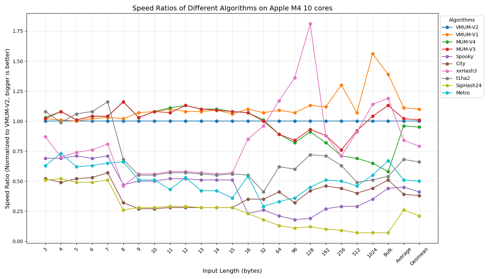
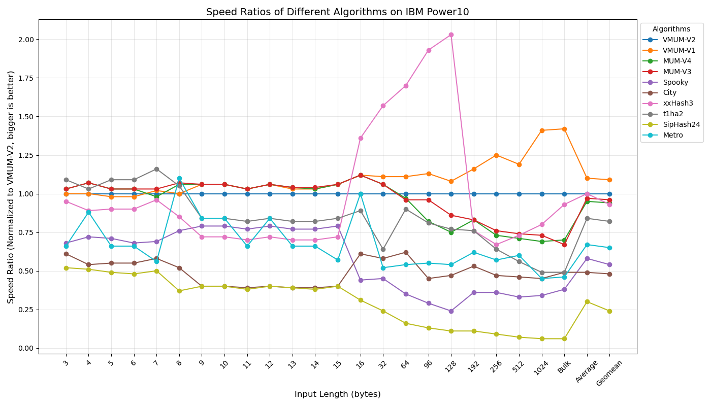

# **Update Jan. 2025: New VMUM Hash and Benchmarks**
* Six years have gone by since the last code release
* New Vector mum-hash (**vmum**) has been released
* New hashing speed data for modern CPUs is provided (see below) for
  vmum and other different famous hashing algorithms
* Mum v3 was updated.  It became more machine-independent and there
  is an option to make it pass **all the tests** of a more rigorous version of
  [SMHasher](https://github.com/rurban/smhasher)
  (see datails below).
	
# MUM Hash
* MUM hash is a **fast non-cryptographic hash function**
  suitable for different hash table implementations
* MUM means **MU**ltiply and **M**ix
  * It is a name of the base transformation on which hashing is implemented
  * Modern processors have a fast logic to do long number multiplications
  * It is very attractive to use it for fast hashing
    * For example, 64x64-bit multiplication can do the same work as 32
      shifts and additions
  * I'd like to call it Multiply and Reduce.  Unfortunately, MUR
    (MUltiply and Rotate) is already taken for famous hashing
    technique designed by Austin Appleby
  * I've chosen the name also as the first release happened on Mother's day
* To use mum you just need one header file (mum.h)
* MUM hash passes **all** [SMHasher](https://github.com/aappleby/smhasher) tests
  * For comparison, only 4 out of 15 non-cryptographic hash functions
    in SMHasher passes the tests, e.g. well known FNV, Murmur2,
    Lookup, and Superfast hashes fail the tests
* MUM V3 hash does not pass the following tests of a more rigourous
  version of [SMHasher](https://github.com/rurban/smhasher):
  * It fails on Perlin noise and bad seeds tests.  It means it still
    qualitative enough for the most applications
  * To make MUM V3 to pass the Rurban SMHasher, macro `MUM_QUALITY` has been
    added.  Compilation with this defined macro makes MUM V3 to pass
    all tests of Rurban SMHasher.  The slowdown is about 5% in average
    or 10% at most on keys of length 8.
* For historic reasons mum.h contains code for older version V1 and
  V2.  You can switch them on by defining macros **MUM_V1** and **MUM_V2**
* MUM algorithm is **simpler** than the VMUM one
* MUM is specifically **designed to be fast on 64-bit CPUs**
  * Still MUM will work for 32-bit CPUs and it will be sometimes
    faster than Spooky and City
* MUM has a **fast startup**.  It is particular good to hash small keys
  which are prevalent in hash table applications

# MUM implementation details

* Input 64-bit data is randomized by 64x64->128 bit multiplication and mixing
  high- and low-parts of the multiplication result by using addition.
  The result is mixed with the current internal state by using XOR
  * Instead of addition for mixing high- and low- parts, XOR could be
    used
    * Using addition instead of XOR improves performance by about
      10% on Haswell and Power7
* Factor numbers, randomly generated with an equal probability of their
  bit values, are used for the multiplication
* When all factors are used once, the internal state is randomized, and the same
  factors are used again for subsequent data randomization
* The main loop is formed to be **unrolled** by the compiler to benefit from the
  the compiler instruction scheduling optimization and OOO
  (out-of-order) instruction execution in modern CPUs
* MUM code does not contain assembly (asm) code anymore. This makes MUM less
  machine-dependent.  To have efficient mum implementation, the
  compiler should support 128-bit integer
  extension (true for GCC and Clang on many targets)

# VMUM Hash
* VMUM is a vector variant of mum hashing (see below)
  * It uses target SIMD instructions (insns)
  * In comparison with mum v3, vmum considerably (up to 3 times) improves the speed
    of hashing mid-range (32 to 256 bytes) to long-range (more 256 bytes) length keys
  * As with previous mum hashing, to use vmum you just need one header
    file (vmum.h)
  * vmum source code is considerably smaller than that of extremely
    fast xxHash3 and th1ha2 and competes with them on hashing speed
  * vmum passes a more rigorous version of
    [SMHasher](https://github.com/rurban/smhasher)
   
# VMUM implementation details
* For long keys vmum uses vector insns:
  * AVX2 256-bit vector insns on x86-64
  * Neon 128-bit vector insns on aarch64
  * Altivec 128-bit vector insns on ppc64
  * There is a scalar emulation of the vector insns, too, for other targets
	* This could be useful for understanding used the vector
      operations used
* You can add usage of vector insns for other targets.  For this you
    just need to add small functions `_vmum_update_block`,
    `_vmum_zero_block`, and `_vmum_fold_block`
  * For the beneficial usage of vector insns the target should have unsigned `32 x 32-bit ->
    64-bit` vector multiplication
* To run vector insns in parallel on OOO CPUs, two vmum code loops are formed
  to be **unrolled** by the compiler into one basic block
* I experimented a lot with other vector insns and found that the usage of
  carry-less (sometimes called polynomial) vector multiplication insns does not work
  well enough for hashing

# VMUM and MUM benchmarking vs other famous hash functions

* Here are the results of benchmarking VMUM and MUM with the fastest
  non-cryptographic hash functions I know:
  * Google City64 (sources are taken from SMHasher)
  * Bob Jenkins Spooky (sources are taken from SMHasher)
  * Yann Collet's xxHash3 (sources are taken from the
    [original repository](https://github.com/Cyan4973/xxHash))
* I also added J. Aumasson and D. Bernstein's
  [SipHash24](https://github.com/veorq/SipHash) for the comparison as it
  is a popular choice for hash table implementation these days
* A [metro hash](https://github.com/jandrewrogers/MetroHash)
  was added as people asked and as metro hash is
  claimed to be the fastest hash function
    * metro hash is not portable as others functions as it does not deal
      with the unaligned accesses problem on some targets
    * metro hash will produce different hash for LE/BE targets
* Measurements were done on 4 different architecture machines:
  * AMD Ryzen 9900X
  * Intel i5-1300K
  * IBM Power10
  * Apple M4 10 cores (mac mini)
* Hashing 10,000 of 16MB keys (bulk)
* Hashing 1,280M keys for all other length keys
* Each test was run 3 times and the minimal time was taken
  * GCC-14.2.1 was used on AMD and M4 machine, GCC-12.3.1 on Intel
    machine, GCC-11.5.0 was used on Power10
  * `-O3` was used for all compilations
  * The keys were generated by `rand` calls
  * The keys were aligned to see a hashing speed better and to permit runs for Metro
  * Some people complaint that my comparison is unfair as most hash functions are not inlined
    * I believe that the interface is the part of the implementation.  So when
      the interface does not provide an easy way for inlining, it is an
      implementation pitfall
    * Still to address the complaints I added `-flto` for benchmarking all hash
      functions excluding MUM and VMUM.  This option makes cross-file inlining
* Here are graphs summarizing the measurements:

* Exact numbers are given in the last section

# SMhasher Speed Measurements

* SMhasher also measures hash speeds.  It uses the CPU cycle counter (__rtdc)
  * __rtdc-based measurements might be inaccurate for a small number of
    executed insns as the process can migrate, not all insns can
    retire, and CPU freq can be different.  That is why I prefer long
    running benchmarks
* Here are the results on AMD Ryzen 9900X for the fastest quality hashes
  (chosen according to SMhasher bulk speed results from https://github.com/rurban/smhasher)
* More GB/sec is better.  Less cycles/hash is better
* Some hashes are based on the use of x86\_64 AES insns and are less portable.
  They are marked by "Yes" in the AES column 
* The SLOC column gives the source code lines to implement the hash
  
| Hash            | AES  | Bulk Speed (256KB): GB/s |Av. Speed on keys (1-32 bytes): cycles/hash| SLOC|
|:----------------|:----:|-------------------------:|------------------------------------------:|----:|
|VMUM             |  -   |  143.5                   | 16.8                                      |408  |
|MUM              |  -   |   39.5                   | 16.1                                      |282  |
|xxh3             |  -   |   66.6                   | 17.6                                      |965  |
|umash64          |  -   |   63.1                   | 25.4                                      |1097 |
|FarmHash32       |  -   |   39.8                   | 32.6                                      |1423 |
|wyhash           |  -   |   39.3                   | 18.3                                      | 194 |
|clhash           |  -   |   38.4                   | 51.7                                      | 366 |
|t1ha2\_atonce    |  -   |   34.7                   | 25.5                                      |2262 |
|t1ha0\_aes\_avx2 | Yes  |  128.9                   | 25.0                                      |2262 |
|gxhash64         | Yes  |  197.1                   | 27.9                                      | 274 |
|aesni            | Yes  |   38.7                   | 28.5                                      | 132 |

# Using cryptographic vs. non-cryptographic hash function
  * People worrying about denial attacks based on generating hash
    collisions started to use cryptographic hash functions in hash tables
  * Cryptographic functions are very slow
    * *sha1* is about 20-30 times slower than MUM and City on the bulk speed tests
    * The new fastest cryptographic hash function *SipHash* is up to 10
      times slower
  * MUM and VMUM are also *resistant* to preimage attack (finding a
    key with a given hash) 
    * To make hard moving to previous state values we use mostly 1-to-1 one way
      function `lo(x*C) + hi(x*C)` where C is a constant.  Brute force
      solution of equation `f(x) = a` probably requires `2^63` tries.
      Another used function equation `x ^ y = a` has a `2^64`
      solutions.  It complicates finding the overal solution further
  * If somebody is not convinced, you can use **randomly chosen
    multiplication constants** (see functions `mum_hash_randomize` and
    `vmum_hash_randomize`).
    Finding a key with a given hash even if you know a key with such
    a hash probably will be close to finding two or more solutions of
    *Diophantine* equations
  * If somebody is still not convinced, you can implement hash tables
    to **recognize the attack and rebuild** the table using the MUM function
    with the new multiplication constants
  * Analogous approach can be used if you use weak hash function as
    MurMur or City.  Instead of using cryptographic hash functions
    **all the time**, hash tables can be implemented to recognize the
    attack and rebuild the table and start using a cryptographic hash
    function
  * This approach solves the speed problem and permits us to switch easily to a new
    cryptographic hash function if a flaw is found in the old one, e.g., switching from
    SipHash to SHA2
  
# How to use [V]MUM
* Please just include file `[v]mum.h` into your C/C++ program and use the following functions:
  * optional `[v]mum_hash_randomize` for choosing multiplication constants randomly
  * `[v]mum_hash_init`, `[v]mum_hash_step`, and `[v]mum_hash_finish` for hashing complex data structures
  * `[v]mum_hash64` for hashing a 64-bit data
  * `[v]mum_hash` for hashing any continuous block of data
* To compare MUM and VMUM speed with other hash functions on your machine go to
  the directory `src` and run a script `./bench.sh`
* The script will compile source files and run the tests printing the
  results as a markdown table

# Crypto-hash function MUM512
  * [V]MUM is not designed to be a crypto-hash
    * The key (seed) and state are only 64-bit which are not crypto-level ones
    * The result can be different for different targets (BE/LE
      machines, 32- and 64-bit machines) as for other hash functions, e.g. City (hash can be
      different on SSE4.2 nad non SSE4.2 targets) or Spooky (BE/LE machines)
      * If you need the same MUM hash independent on the target, please
        define macro `[V]MUM_TARGET_INDEPENDENT_HASH`
  * There is a variant of MUM called MUM512 which can be a **candidate**
    for a crypto-hash function and keyed crypto-hash function and
    might be interesting for researchers
    * The **key** is **256**-bit
    * The **state** and the **output** are **512**-bit
    * The **block** size is **512**-bit
    * It uses 128x128->256-bit multiplication which is analogous to about
      64 shifts and additions for 128-bit block word instead of 80
      rounds of shifts, additions, logical operations for 512-bit block
      in sha2-512.
  * It is **only a candidate** for a crypto hash function
    * I did not make any differential crypto-analysis or investigated
      probabilities of different attacks on the hash function (sorry, it
      is too big job)
      * I might be do this in the future as I am interested in
        differential characteristics of the MUM512 base transformation
        step (128x128-bit multiplications with addition of high and
        low 128-bit parts)
      * I am also interested in the right choice of the multiplication constants
      * May be somebody will do the analysis.  I will be glad to hear anything.
        Who knows, may be it can be easily broken as Nimbus cipher.
    * The current code might be also vulnerable to timing attack on
      systems with varying multiplication instruction latency time.
      There is no code for now to prevent it
  * To compare the MUM512 speed with the speed of SHA-2 (SHA512) and
    SHA-3 (SHA3-512) go to the directory `src` and run a script `./bench-crypto.sh`
    * SHA-2 and SHA-3 code is taken from [RHash](https://github.com/rhash/RHash.git)
  * Blake2 crypto-hash from [github.com/BLAKE2/BLAKE2](https://github.com/BLAKE2/BLAKE2)
    was added for comparison.  I use sse version of 64-bit Blake2 (blake2b).
  * Here is the speed of the crypto hash functions on AMD 9900X:

|                        | MUM512 | SHA2  |  SHA3  | Blake2B|
:------------------------|-------:|------:|-------:|-------:|
10 bytes (20 M texts)    | 0.27s  | 0.27s |  0.44s |  0.81s |
100 bytes (20 M texts)   | 0.36s  | 0.25s |  0.84s |  0.84s |
1000 bytes (20 M texts)  | 1.21s  | 2.08s | 5.63s  |  3.70s |
10000 bytes (5 M texts)  | 5.60s  | 5.05s | 14.07s |  7.99s |

# Pseudo-random generators
  * Files `mum-prng.h` and `mum512-prng.h` provide pseudo-random
    functions based on MUM and MUM512 hash functions
  * All PRNGs passed *NIST Statistical Test Suite for Random and
    Pseudorandom Number Generators for Cryptographic Applications*
    (version 2.2.1) with 1000 bitstreams each containing 1M bits
    * Although MUM PRNG passed the test, it is not a cryptographically
      secure PRNG as is the hash function used for it
  * To compare the PRNG speeds go to
    the directory `src` and run a script `./bench-prng.sh`
  * For the comparison I wrote crypto-secured Blum Blum Shub PRNG
    (file `bbs-prng.h`) and PRNGs based on fast cryto-level hash
    functions in ChaCha stream cipher (file `chacha-prng.h`) and
    SipHash24 (file `sip24-prng.h`).
    * The additional PRNGs also pass the Statistical Test Suite
  * For the comparison I also added the fastest PRNGs
    * [xoroshiro128+](http://xoroshiro.di.unimi.it/xoroshiro128plus.c)
    * [xoroshiro128**](http://xoroshiro.di.unimi.it/xoroshiro128starstar.c)
    * [xoshiro256+](http://xoroshiro.di.unimi.it/xoshiro256plus.c)
    * [xoshiro256**](http://xoroshiro.di.unimi.it/xoshiro256starstar.c)
    * [xoshiro512**](http://xoroshiro.di.unimi.it/xoshiro512starstar.c)
    * As recommended the first numbers generated by splitmix64 were used as a seed
  * I had no intention to tune MUM based PRNG first but
    after adding xoroshiro128+ and finding how fast it is, I've decided
    to speedup MUM PRNG
    * I added code to calculate a few PRNs at once to calculate them in parallel
    * I added AVX2 version functions to use the faster `MULX` instruction
    * The new version also passed NIST Statistical Test Suite.  It was
      tested even on bigger data (10K bitstreams each containing 10M
      bits).  The test took several days on i7-4790K
    * The new version is **almost 2 times** faster than the old one and MUM PRN
      speed became almost the same as xoroshiro/xoshiro ones
      * All xoroshiro/xoshiro and MUM PRNG functions are inlined in the benchmark program
      * Both code without inlining will be visibly slower and the speed
        difference will be negligible as one PRN calculation takes
        only about **3-4 machine cycle** for xoroshiro/xoshiro and MUM PRN.
  * **Update Nov.2 2019**: I found that MUM PRNG fails practrand on 512GB.  So I modified it.
    Instead of basically 16 independent PRNGs with 64-bit state, I made it one PRNG with 1024-bit state.
    I also managed to speed up MUM PRNG by 15%.
  * All PRNG were tested by [practrand](http://pracrand.sourceforge.net/) with
    4TB PRNG generated stream (it took a few days)
      * **GLIBC RAND, xoroshiro128+, xoshiro256+, and xoshiro512+ failed** on the first stages of practrand
      * The rest of the PRNGs passed
      * BBS PRNG was tested by only 64GB stream because it is too slow
  * Here is the speed of the PRNGs in millions generated PRNs
    per second:

|  M prns/sec  | AMD 9900X   |Intel i5-1360K| Apple M4    | Power10  |
:--------------|------------:|-------------:|------------:|---------:|
BBS            | 0.0886      | 0.0827       | 0.122       | 0.021    |
ChaCha         | 357.68      | 184.80       | 262.81      |  83.20   |
SipHash24      | 702.10      | 567.43       | 760.13      | 231.48   |
MUM512         |  91.54      | 179.62       | 268.04      |  44.28   |
MUM            |1947.27      |1620.65       |2263.68      | 694.42   |
XOSHIRO128**   |1797.02      |1386.87       |1095.37      | 477.67   |
XOSHIRO256**   |1866.35      |1364.85       |1466.15      | 607.65   |
XOSHIRO512**   |1663.86      |1235.15       |1423.90      | 631.90   |
GLIBC RAND     | 115.57      | 101.48       | 228.99      |  33.66   |
XOROSHIRO128+  |1786.62      |1299.59       |1296.48      | 549.85   |
XOSHIRO256+    |2321.99      |1720.67       |1690.96      | 711.41   |
XOSHIRO512+    |1808.81      |1525.18       |1659.76      | 717.12   |

# Table results for hash speed measurements
* Here are table variants of my measurements for people wanting the
  exact numbers.  The tables also contain time spent for hashing.
  
* AMD Ryzen 9900X:

| Length    |   VMUM    |  MUM-V3   |  MUM-V2   |  Spooky   |   City    |  xxHash3  |   t1ha2   | SipHash24 |   Metro   |
|:----------|:---------:|:---------:|:---------:|:---------:|:---------:|:---------:|:---------:|:---------:|:---------:|
|   3 bytes |1.00   4.6s|1.00   4.6s|0.88   5.2s|0.78   5.9s|0.61   7.5s|0.96   4.8s|0.62   7.4s|0.63   7.3s|0.70   6.6s|
|   4 bytes |1.00   2.7s|1.10   2.5s|0.86   3.2s|0.55   5.0s|0.39   7.1s|0.71   3.9s|0.69   4.0s|0.36   7.7s|0.75   3.6s|
|   5 bytes |1.00   4.6s|1.00   4.6s|0.87   5.2s|0.80   5.7s|0.64   7.1s|0.87   5.2s|0.62   7.4s|0.60   7.6s|0.87   5.2s|
|   6 bytes |1.00   4.6s|1.00   4.6s|0.87   5.2s|0.77   5.9s|0.64   7.1s|0.87   5.2s|0.62   7.4s|0.58   7.9s|0.87   5.2s|
|   7 bytes |1.00   4.8s|1.00   4.8s|0.88   5.5s|0.78   6.2s|0.68   7.1s|0.91   5.2s|0.65   7.4s|0.60   8.0s|0.75   6.4s|
|   8 bytes |1.00   2.7s|1.10   2.5s|0.86   3.2s|0.55   5.0s|0.39   7.1s|0.52   5.2s|0.70   3.9s|0.33   8.2s|0.75   3.6s|
|   9 bytes |1.00   2.8s|0.99   2.8s|0.79   3.5s|0.55   5.0s|0.25  10.9s|0.42   6.6s|0.38   7.3s|0.33   8.2s|0.55   5.0s|
|  10 bytes |1.00   2.8s|0.99   2.8s|0.79   3.5s|0.55   5.0s|0.25  10.9s|0.42   6.6s|0.38   7.3s|0.33   8.3s|0.55   5.0s|
|  11 bytes |1.00   2.8s|0.99   2.8s|0.79   3.5s|0.55   5.0s|0.25  11.0s|0.42   6.6s|0.38   7.3s|0.34   8.3s|0.45   6.2s|
|  12 bytes |1.00   2.8s|0.99   2.8s|0.80   3.5s|0.55   5.0s|0.25  10.9s|0.42   6.6s|0.38   7.3s|0.34   8.3s|0.55   5.0s|
|  13 bytes |1.00   2.8s|0.99   2.8s|0.79   3.5s|0.55   5.0s|0.25  10.9s|0.42   6.6s|0.37   7.4s|0.33   8.3s|0.45   6.2s|
|  14 bytes |1.00   2.8s|0.98   2.8s|0.79   3.5s|0.55   5.0s|0.25  11.0s|0.42   6.6s|0.38   7.3s|0.34   8.3s|0.45   6.2s|
|  15 bytes |1.00   2.8s|0.99   2.8s|0.79   3.5s|0.55   5.0s|0.25  11.0s|0.42   6.6s|0.38   7.3s|0.33   8.3s|0.38   7.3s|
|  16 bytes |1.00   2.8s|1.02   2.7s|0.81   3.4s|0.25  11.0s|0.38   7.3s|0.87   3.2s|0.55   5.1s|0.27  10.4s|0.58   4.8s|
|  32 bytes |1.00   3.0s|0.92   3.3s|0.75   4.1s|0.28  10.9s|0.37   8.2s|0.95   3.2s|0.40   7.5s|0.21  14.4s|0.31   9.8s|
|  48 bytes |1.00   3.3s|0.96   3.5s|0.61   5.4s|0.20  16.7s|0.39   8.4s|1.04   3.2s|0.45   7.4s|0.18  18.7s|0.27  12.4s|
|  64 bytes |1.00   3.7s|0.81   4.5s|0.60   6.1s|0.22  16.8s|0.44   8.4s|1.14   3.2s|0.64   5.8s|0.16  22.9s|0.35  10.6s|
|  96 bytes |1.00   4.2s|0.75   5.7s|0.55   7.7s|0.19  22.5s|0.34  12.7s|1.32   3.2s|0.61   7.0s|0.13  31.5s|0.38  11.3s|
| 128 bytes |1.00   4.6s|0.67   6.9s|0.49   9.3s|0.16  28.3s|0.36  12.7s|1.43   3.2s|0.60   7.6s|0.11  40.0s|0.38  12.0s|
| 192 bytes |1.00   7.0s|0.83   8.4s|0.56  12.4s|0.29  24.1s|0.48  14.7s|0.98   7.1s|0.70   9.9s|0.12  56.9s|0.52  13.4s|
| 256 bytes |1.00   7.9s|0.77  10.2s|0.51  15.4s|0.32  24.5s|0.47  16.9s|0.56  14.1s|0.66  12.0s|0.11  74.6s|0.54  14.6s|
| 512 bytes |1.00  13.9s|0.83  16.9s|0.50  27.7s|0.39  35.5s|0.51  27.5s|0.86  16.1s|0.65  21.3s|0.10 141.1s|0.61  23.0s|
|1024 bytes |1.00  16.5s|0.52  31.8s|0.32  52.3s|0.31  54.1s|0.36  46.0s|0.84  19.7s|0.42  39.1s|0.06 275.3s|0.42  39.5s|
| Bulk      |1.00   1.2s|0.32   3.9s|0.19   6.4s|0.24   5.1s|0.25   5.0s|0.46   2.7s|0.26   4.7s|0.04  34.1s|0.29   4.3s|
| Average   |1.00       |0.90       |0.69       |0.46       |0.39       |0.76       |0.52       |0.29       |0.53       |
| Geomean   |1.00       |0.87       |0.66       |0.41       |0.37       |0.70       |0.50       |0.23       |0.50       |

* Intel i5-13600K:

| Length    |   VMUM    |  MUM-V3   |  MUM-V2   |  Spooky   |   City    |  xxHash3  |   t1ha2   | SipHash24 |   Metro   |
|-----------|:---------:|:---------:|:---------:|:---------:|:---------:|:---------:|:---------:|:---------:|:---------:|
|   3 bytes |1.00   4.6s|1.00   4.5s|0.86   5.3s|0.65   7.0s|0.60   7.6s|0.90   5.0s|0.49   9.4s|0.46   9.9s|0.67   6.8s|
|   4 bytes |1.00   4.3s|1.06   4.0s|0.90   4.8s|0.73   5.9s|0.51   8.4s|0.74   5.8s|0.76   5.6s|0.53   8.1s|0.81   5.3s|
|   5 bytes |1.00   4.6s|1.00   4.5s|0.86   5.3s|0.71   6.4s|0.56   8.2s|0.79   5.8s|0.49   9.4s|0.46   9.9s|0.67   6.8s|
|   6 bytes |1.00   4.6s|1.01   4.5s|0.86   5.3s|0.67   6.8s|0.56   8.2s|0.79   5.8s|0.49   9.4s|0.42  10.8s|0.67   6.8s|
|   7 bytes |1.00   4.9s|1.01   4.9s|0.88   5.6s|0.69   7.1s|0.60   8.2s|0.85   5.8s|0.52   9.4s|0.44  11.0s|0.69   7.0s|
|   8 bytes |1.00   4.3s|1.06   4.0s|0.89   4.8s|0.77   5.6s|0.52   8.2s|0.74   5.8s|0.99   4.3s|0.39  10.9s|1.06   4.0s|
|   9 bytes |1.00   4.3s|1.00   4.3s|0.84   5.1s|0.77   5.6s|0.31  13.6s|0.50   8.6s|0.45   9.5s|0.39  10.9s|0.77   5.5s|
|  10 bytes |1.00   4.3s|1.00   4.3s|0.85   5.1s|0.77   5.6s|0.32  13.6s|0.50   8.6s|0.45   9.5s|0.39  10.9s|0.77   5.5s|
|  11 bytes |1.00   4.3s|1.00   4.3s|0.84   5.1s|0.77   5.6s|0.32  13.6s|0.50   8.6s|0.45   9.5s|0.39  10.9s|0.63   6.8s|
|  12 bytes |1.00   4.3s|1.00   4.3s|0.85   5.1s|0.77   5.6s|0.32  13.6s|0.50   8.6s|0.45   9.5s|0.39  10.9s|0.77   5.5s|
|  13 bytes |1.00   4.3s|1.00   4.3s|0.85   5.1s|0.77   5.6s|0.31  13.6s|0.50   8.6s|0.45   9.5s|0.39  10.9s|0.63   6.8s|
|  14 bytes |1.00   4.3s|1.00   4.3s|0.85   5.1s|0.77   5.6s|0.31  13.6s|0.50   8.6s|0.45   9.5s|0.39  10.9s|0.63   6.8s|
|  15 bytes |1.00   4.3s|1.00   4.3s|0.85   5.1s|0.77   5.6s|0.32  13.6s|0.50   8.6s|0.45   9.5s|0.39  10.9s|0.53   8.1s|
|  16 bytes |1.00   4.3s|1.00   4.3s|0.84   5.1s|0.35  12.1s|0.53   8.1s|0.84   5.1s|0.82   5.2s|0.32  13.4s|0.78   5.5s|
|  32 bytes |1.00   4.6s|0.95   4.8s|0.81   5.6s|0.37  12.4s|0.49   9.4s|0.89   5.1s|0.62   7.3s|0.24  18.9s|0.40  11.4s|
|  48 bytes |1.00   4.8s|0.90   5.4s|0.65   7.5s|0.26  18.7s|0.52   9.4s|0.94   5.1s|0.62   7.8s|0.19  25.9s|0.34  14.3s|
|  64 bytes |1.00   5.1s|0.85   6.0s|0.63   8.1s|0.28  18.6s|0.55   9.3s|1.00   5.1s|0.82   6.2s|0.16  31.6s|0.42  12.1s|
|  96 bytes |1.00   5.8s|0.78   7.4s|0.58   9.9s|0.23  25.2s|0.42  13.9s|1.11   5.2s|0.76   7.6s|0.14  42.7s|0.45  13.0s|
| 128 bytes |1.00   6.3s|0.72   8.7s|0.56  11.1s|0.20  31.5s|0.45  13.9s|1.19   5.3s|0.72   8.7s|0.12  53.8s|0.45  13.8s|
| 192 bytes |1.00   7.8s|0.75  10.4s|0.54  14.4s|0.27  29.5s|0.47  16.5s|0.84   9.2s|0.70  11.2s|0.10  76.0s|0.51  15.4s|
| 256 bytes |1.00   8.9s|0.71  12.6s|0.51  17.5s|0.30  29.9s|0.47  19.0s|0.57  15.6s|0.65  13.8s|0.09  97.4s|0.53  16.9s|
| 512 bytes |1.00  14.8s|0.76  19.5s|0.49  30.0s|0.33  45.5s|0.43  34.7s|0.89  16.6s|0.54  27.5s|0.08 185.6s|0.50  29.8s|
|1024 bytes |1.00  19.0s|0.51  37.1s|0.35  54.1s|0.26  71.9s|0.31  61.6s|0.73  26.1s|0.38  50.3s|0.05 362.2s|0.32  59.3s|
| Bulk      |1.00   2.9s|0.56   5.2s|0.42   6.9s|0.37   7.8s|0.40   7.3s|0.77   3.8s|0.46   6.3s|0.06  46.0s|0.41   7.1s|
| Average   |1.00       |0.90       |0.73       |0.53       |0.44       |0.75       |0.58       |0.29       |0.60       |
| Geomean   |1.00       |0.89       |0.71       |0.48       |0.43       |0.73       |0.56       |0.24       |0.58       |

* Apple M4:

| Length    |   VMUM    |  MUM-V3   |  MUM-V2   |  Spooky   |   City    |  xxHash3  |   t1ha2   | SipHash24 |   Metro   |
|-----------|:---------:|:---------:|:---------:|:---------:|:---------:|:---------:|:---------:|:---------:|:---------:|
|   3 bytes |1.00   5.0s|1.00   5.0s|0.86   5.9s|0.67   7.5s|0.51   9.9s|0.85   5.9s|1.05   4.8s|0.50  10.0s|0.62   8.2s|
|   4 bytes |1.00   4.7s|1.07   4.4s|0.87   5.3s|0.69   6.8s|0.48   9.6s|0.70   6.7s|0.98   4.8s|0.52   9.0s|0.73   6.4s|
|   5 bytes |1.00   5.0s|1.01   5.0s|0.83   6.1s|0.71   7.1s|0.52   9.6s|0.74   6.8s|1.06   4.8s|0.49  10.4s|0.62   8.2s|
|   6 bytes |1.00   5.0s|1.02   5.0s|0.86   5.8s|0.67   7.5s|0.52   9.6s|0.74   6.8s|1.06   4.8s|0.48  10.5s|0.62   8.2s|
|   7 bytes |1.00   5.4s|1.01   5.3s|0.86   6.2s|0.69   7.8s|0.56   9.6s|0.79   6.8s|1.13   4.8s|0.50  10.8s|0.63   8.5s|
|   8 bytes |1.00   3.1s|1.14   2.7s|0.83   3.7s|0.47   6.5s|0.32   9.6s|0.46   6.7s|0.68   4.5s|0.26  11.7s|0.66   4.7s|
|   9 bytes |1.00   3.0s|0.98   3.1s|0.77   4.0s|0.47   6.5s|0.25  12.0s|0.52   5.9s|0.51   6.0s|0.26  11.7s|0.47   6.4s|
|  10 bytes |1.00   3.0s|1.00   3.0s|0.76   4.0s|0.47   6.5s|0.26  12.0s|0.52   5.9s|0.51   6.0s|0.26  11.7s|0.48   6.4s|
|  11 bytes |1.00   3.1s|0.99   3.1s|0.78   4.0s|0.48   6.5s|0.26  12.0s|0.53   5.9s|0.52   6.0s|0.26  11.7s|0.39   7.9s|
|  12 bytes |1.00   3.1s|1.00   3.0s|0.75   4.1s|0.47   6.5s|0.26  12.0s|0.52   5.9s|0.51   6.0s|0.26  11.7s|0.48   6.4s|
|  13 bytes |1.00   3.1s|1.00   3.1s|0.78   4.0s|0.48   6.5s|0.26  12.0s|0.53   5.9s|0.52   6.0s|0.26  11.7s|0.39   7.9s|
|  14 bytes |1.00   3.2s|1.04   3.1s|0.81   4.0s|0.50   6.5s|0.27  12.0s|0.55   5.9s|0.54   6.0s|0.27  11.7s|0.41   7.9s|
|  15 bytes |1.00   3.1s|1.00   3.1s|0.78   4.0s|0.48   6.5s|0.26  12.0s|0.53   5.9s|0.52   6.0s|0.27  11.7s|0.33   9.3s|
|  16 bytes |1.00   3.0s|0.97   3.2s|0.77   4.0s|0.22  14.1s|0.33   9.3s|0.79   3.9s|0.51   6.0s|0.21  14.6s|0.50   6.1s|
|  32 bytes |1.00   3.5s|0.93   3.7s|0.76   4.6s|0.25  14.1s|0.33  10.5s|0.92   3.8s|0.38   9.0s|0.17  20.7s|0.28  12.6s|
|  48 bytes |1.00   3.8s|0.85   4.4s|0.72   5.2s|0.18  21.4s|0.35  10.8s|0.99   3.8s|0.42   9.0s|0.14  27.9s|0.24  15.5s|
|  64 bytes |1.00   4.2s|0.82   5.1s|0.71   5.9s|0.20  21.4s|0.39  10.8s|1.10   3.8s|0.59   7.1s|0.12  34.1s|0.31  13.4s|
|  96 bytes |1.00   4.9s|0.77   6.3s|0.68   7.2s|0.17  28.7s|0.30  16.2s|1.28   3.8s|0.57   8.6s|0.10  46.7s|0.34  14.3s|
| 128 bytes |1.00   6.3s|0.83   7.6s|0.74   8.4s|0.17  36.0s|0.39  16.2s|1.65   3.8s|0.65   9.6s|0.10  61.4s|0.41  15.2s|
| 192 bytes |1.00   7.8s|0.77  10.1s|0.64  12.2s|0.24  31.9s|0.42  18.6s|0.84   9.3s|0.62  12.5s|0.09  85.4s|0.46  17.0s|
| 256 bytes |1.00   7.3s|0.58  12.6s|0.49  14.7s|0.22  32.4s|0.34  21.3s|0.54  13.6s|0.47  15.3s|0.07 110.2s|0.39  18.8s|
| 512 bytes |1.00  13.9s|0.85  16.3s|0.75  18.6s|0.27  51.8s|0.36  38.3s|0.84  16.5s|0.45  31.1s|0.07 212.1s|0.42  32.8s|
|1024 bytes |1.00  18.0s|0.66  27.2s|0.53  34.0s|0.22  81.0s|0.28  64.4s|0.73  24.6s|0.32  55.8s|0.04 412.4s|0.35  52.1s|
| Bulk      |1.00   2.5s|0.80   3.1s|0.60   4.1s|0.31   8.0s|0.36   6.8s|0.86   2.9s|0.38   6.4s|0.05  52.2s|0.48   5.2s|
| Average   |1.00       |0.92       |0.75       |0.40       |0.36       |0.77       |0.62       |0.24       |0.46       |
| Geomean   |1.00       |0.91       |0.74       |0.36       |0.35       |0.73       |0.58       |0.19       |0.44       |

* IBM Power10:

| Length    |   VMUM    |  MUM-V3   |  MUM-V2   |  Spooky   |   City    |  xxHash3  |   t1ha2   | SipHash24 |   Metro   |
|:----------|:---------:|:---------:|:---------:|:---------:|:---------:|:---------:|:---------:|:---------:|:---------:|
|   3 bytes |1.00  11.5s|1.03  11.2s|0.88  13.1s|0.68  16.9s|0.61  18.9s|0.95  12.2s|1.09  10.6s|0.52  22.2s|0.66  17.3s|
|   4 bytes |1.00  10.9s|1.07  10.2s|0.89  12.2s|0.71  15.2s|0.54  20.2s|0.89  12.3s|1.03  10.6s|0.51  21.2s|0.87  12.4s|
|   5 bytes |1.00  11.7s|1.05  11.2s|0.89  13.2s|0.72  16.2s|0.56  20.9s|0.92  12.8s|1.11  10.6s|0.49  23.7s|0.68  17.3s|
|   6 bytes |1.00  11.7s|1.05  11.2s|0.89  13.2s|0.70  16.8s|0.56  20.9s|0.91  12.8s|1.11  10.6s|0.49  24.0s|0.67  17.3s|
|   7 bytes |1.00  11.9s|1.01  11.8s|0.82  14.5s|0.67  17.7s|0.57  20.9s|0.93  12.8s|1.13  10.6s|0.49  24.4s|0.54  22.0s|
|   8 bytes |1.00  10.8s|1.07  10.2s|0.89  12.2s|0.76  14.3s|0.52  20.9s|0.85  12.8s|1.05  10.3s|0.37  29.1s|1.10   9.8s|
|   9 bytes |1.00  10.9s|1.00  10.8s|0.84  12.9s|0.75  14.5s|0.38  28.9s|0.67  16.1s|0.79  13.7s|0.37  29.3s|0.79  13.8s|
|  10 bytes |1.00  10.9s|1.00  10.8s|0.84  12.9s|0.75  14.6s|0.38  28.9s|0.67  16.1s|0.79  13.7s|0.38  28.9s|0.79  13.8s|
|  11 bytes |1.00  10.9s|1.00  10.8s|0.84  12.9s|0.75  14.6s|0.38  28.9s|0.68  16.1s|0.79  13.7s|0.37  29.1s|0.64  17.1s|
|  12 bytes |1.00  10.9s|1.00  10.8s|0.84  12.9s|0.75  14.6s|0.38  28.9s|0.67  16.1s|0.79  13.7s|0.37  29.0s|0.79  13.8s|
|  13 bytes |1.00  10.9s|1.00  10.8s|0.85  12.8s|0.75  14.6s|0.38  28.9s|0.68  16.1s|0.79  13.7s|0.37  29.0s|0.64  17.1s|
|  14 bytes |1.00  10.9s|1.00  10.9s|0.84  12.9s|0.75  14.6s|0.38  28.9s|0.67  16.1s|0.79  13.7s|0.38  28.9s|0.64  17.1s|
|  15 bytes |1.00  10.9s|1.00  10.9s|0.85  12.9s|0.75  14.6s|0.38  28.9s|0.68  16.1s|0.79  13.7s|0.37  29.1s|0.53  20.4s|
|  16 bytes |1.00  10.9s|1.00  10.9s|0.85  12.9s|0.39  27.7s|0.54  20.1s|1.22   9.0s|0.79  13.7s|0.27  39.8s|0.90  12.2s|
|  32 bytes |1.00  11.6s|0.95  12.2s|0.81  14.3s|0.40  28.6s|0.52  22.3s|1.41   8.2s|0.57  20.3s|0.21  54.9s|0.46  25.0s|
|  48 bytes |1.00  12.3s|0.91  13.5s|0.79  15.6s|0.30  41.1s|0.53  23.3s|1.50   8.2s|0.61  20.2s|0.17  72.8s|0.40  31.1s|
|  64 bytes |1.00  13.1s|0.87  15.1s|0.77  17.0s|0.32  41.3s|0.56  23.3s|1.54   8.5s|0.81  16.2s|0.15  88.0s|0.49  26.8s|
|  96 bytes |1.00  14.3s|0.86  16.7s|0.63  22.5s|0.26  54.3s|0.40  35.3s|1.73   8.2s|0.73  19.6s|0.12 119.1s|0.49  28.8s|
| 128 bytes |1.00  15.4s|0.79  19.5s|0.62  25.1s|0.22  68.7s|0.44  35.3s|1.88   8.2s|0.71  21.8s|0.10 155.0s|0.50  30.8s|
| 192 bytes |1.00  19.0s|0.72  26.6s|0.65  29.0s|0.31  61.0s|0.46  41.3s|0.66  28.8s|0.66  29.0s|0.10 195.7s|0.54  35.1s|
| 256 bytes |1.00  17.9s|0.61  29.3s|0.53  33.7s|0.29  62.6s|0.38  47.4s|0.53  33.5s|0.51  35.0s|0.07 252.4s|0.46  39.1s|
| 512 bytes |1.00  28.2s|0.62  45.6s|0.56  50.5s|0.28 100.7s|0.38  73.3s|0.61  46.4s|0.47  60.2s|0.06 483.3s|0.50  55.9s|
|1024 bytes |1.00  40.1s|0.51  78.0s|0.48  83.4s|0.24 167.1s|0.32 126.5s|0.57  70.6s|0.34 116.4s|0.04 944.6s|0.32 127.0s|
| Bulk      |1.00   7.5s|0.69  10.7s|0.67  11.1s|0.43  17.5s|0.53  14.0s|0.69  10.8s|0.51  14.6s|0.06 118.6s|0.50  14.9s|
| Average   |1.00       |0.91       |0.77       |0.54       |0.46       |0.94       |0.78       |0.28       |0.62       |
| Geomean   |1.00       |0.89       |0.76       |0.49       |0.45       |0.87       |0.75       |0.22       |0.60       |

